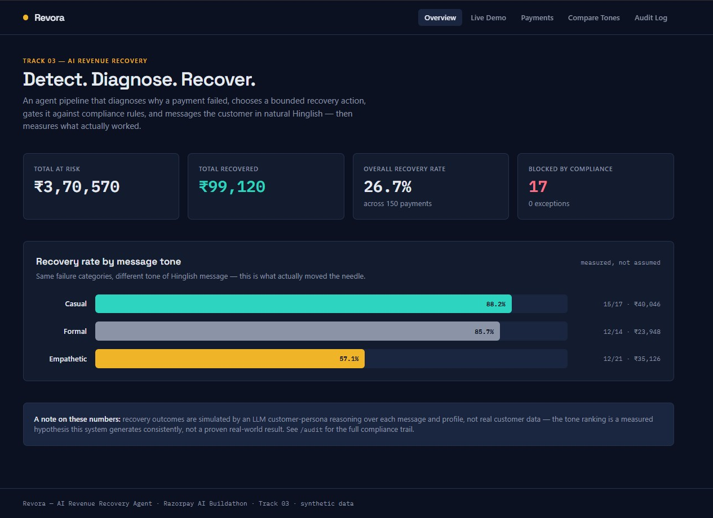
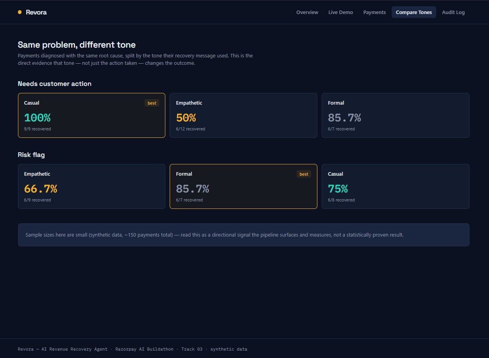
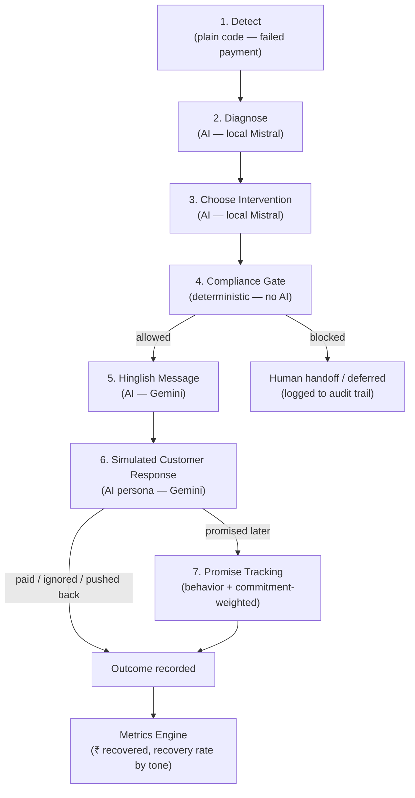

# Revora — AI Revenue Recovery Agent

**Razorpay AI Buildathon · Track 03 — AI Revenue Recovery**

Revora detects revenue at risk from failed payments, diagnoses *why* each one failed, chooses a bounded recovery action, gates that action against compliance rules, messages the customer in natural Hinglish, and measures what actually worked — end to end, with a full audit trail.

> Built and validated on a synthetic dataset representative of real payment-failure patterns. Each stage (diagnosis, compliance gating, message generation) is production-shaped and could plug into a real payment gateway's webhook data using the same logic.

---

## Screenshots

**Overview — headline metrics and tone-effectiveness chart**


**Compare Tones — same failure category, different tone, different outcome**


## The problem

Revenue loss from failed payments rarely happens in one clean step — a card expires, a gateway times out, a customer's funds run short, a subscription lapses. Recovering that revenue requires diagnosing the actual cause, choosing the right response, respecting compliance limits on how and when a customer can be contacted, and tracking whether the response actually worked.

Most of this *can* be done with plain rules — detecting a failed payment is a database query, not AI. Revora is deliberately built so **AI does the reasoning-heavy work (diagnosis, intervention choice, natural-language messaging, response interpretation) while deterministic code handles the parts that must be predictable and auditable (compliance limits, escalation caps).**

---

## Architecture



**Why this split matters:** detection and hard compliance limits are deterministic on purpose — a system that lets an LLM decide whether it's allowed to contact someone again is a compliance risk, not a feature. Diagnosis, intervention choice, message tone, and response interpretation are where genuine reasoning is needed, so that's where AI is used.

### Stack

| Layer | Tech |
|---|---|
| Diagnosis + Intervention choice | Local LLM via Ollama (Mistral) — zero rate limits, runs on your machine |
| Message generation + Response simulation | Gemini API (low volume — only unique combinations, not per-payment) |
| Compliance gate, escalation, metrics | Plain Python — deterministic, no AI |
| Backend | FastAPI, serving both batch results and a live Server-Sent-Events stream |
| Frontend | Next.js + TypeScript + Tailwind |

---

## Repository structure

```
revenue-recovery-agent/        # pipeline scripts, FastAPI backend, data
  ├── data/                    # synthetic dataset + all pipeline outputs (CSV/JSON)
  ├── generate_data.py         # synthetic payment + customer dataset generator
  ├── diagnoser.py             # Stage 2 — root-cause diagnosis (batch)
  ├── intervention_chooser.py  # Stage 3 — action + tone selection (batch)
  ├── add_optout_field.py      # one-time: marks ~10% of customers opted out
  ├── compliance_gate.py       # Stage 4 — deterministic rule enforcement (batch)
  ├── message_generator.py     # Stage 5 — Hinglish message generation (batch)
  ├── response_simulator.py    # Stage 6 — AI customer-persona response (batch)
  ├── promise_tracker.py       # Stage 7 — promise-kept modeling + escalation (batch)
  ├── metrics_engine.py        # rolls up all stages into final measured results
  ├── pipeline.py              # shared core — stage logic, compliance rules, sanitization
  ├── live_processor.py        # FastAPI router: CSV upload → live SSE stream
  ├── main.py                  # FastAPI app — serves batch results + live endpoint
  └── tests/                   # pytest suite for the deterministic layer

revenue-recovery-dashboard/    # Next.js frontend
  └── app/
      ├── page.tsx             # Overview — headline metrics, tone comparison chart
      ├── live/                # Upload a CSV, watch the agent process it live
      ├── payments/             # All payments + per-payment agent trace
      ├── compare/              # Same failure category, different tone, different outcome
      └── audit/                # Every compliance-blocked action, and why
```

---

## Running it

### 1. Pipeline (batch)

```bash
cd revenue-recovery-agent
python -m venv venv
venv\Scripts\activate          # Windows
pip install -r requirements_backend.txt
pip install requests python-dotenv google-genai
```

Add a `.env` file with `GEMINI_API_KEY=your_key_here` (free tier at [aistudio.google.com](https://aistudio.google.com)).

Make sure [Ollama](https://ollama.com) is running locally with `mistral` pulled.

Run the pipeline in order:

```bash
python generate_data.py
python add_optout_field.py
python diagnoser.py
python intervention_chooser.py
python compliance_gate.py
python message_generator.py
python response_simulator.py
python promise_tracker.py
python metrics_engine.py
```

Each script is resumable — if interrupted, re-running picks up where it left off.

### 2. Backend

```bash
uvicorn main:app --reload
```

Serves batch results at `http://localhost:8000` (see `/docs` for all endpoints) and the live-processing SSE endpoint.

The browser origins allowed to call the API are controlled by `ALLOWED_ORIGINS` (comma-separated) in `.env`, defaulting to `http://localhost:3000,http://127.0.0.1:3000`. Set it explicitly if you serve the dashboard from a different host or port.

### 3. Tests

```bash
cd revenue-recovery-agent
pip install -r requirements-dev.txt
pytest tests -q
```

The suite covers the deterministic layer — every compliance rule and its boundaries, rule precedence (opt-out beats time window beats contact cap), exception fall-through handling, attempt-hour stability, input sanitization, and amount parsing. The AI stages are deliberately not unit-tested against live models; they are exercised end-to-end by the batch pipeline.

### 4. Frontend

```bash
cd revenue-recovery-dashboard
npm install
npm run dev
```

Open `http://localhost:3000`.

---

## Measured results

On a synthetic batch of **150 payments**:

| Metric | Value |
|---|---|
| Total amount at risk | ₹3,70,570 |
| Total amount recovered | ₹99,120 |
| Overall recovery rate | 26.7% |
| Blocked by compliance gate | 17 |
| Exceptions | 0 |

### Recovery rate by message tone

| Tone | Recovery rate | Sample |
|---|---|---|
| Casual | 88.2% | 15/17 |
| Formal | 85.7% | 12/14 |
| Empathetic | 57.1% | 12/21 |

**The more interesting finding is contextual, not a flat ranking.** Broken down by failure category, the best-performing tone changes:

- **"Needs customer action" failures** (e.g. expired card) → **casual** wins (100%)
- **"Risk flag" failures** (repeated failures, fraud signals) → **formal** wins (85.7%)

This suggests the right tone depends on *why* the payment failed, not a single universal "best" tone — a risk-flagged customer responds better to a direct, formal approach, while a routine action-needed customer responds better to a casual nudge.

*A note on these numbers: recovery outcomes are simulated by an LLM customer-persona reasoning over each message and customer profile, not real customer data. The tone ranking is a measured hypothesis this system generates consistently, not a proven real-world result — and with sample sizes this small (single-digit to low-double-digit per cell), re-running the pipeline can shift individual cell percentages, though the overall pattern of "context changes the best tone" has held across runs.*

---

## Assumptions, stated explicitly

- **Promise-keep probability** varies by the customer's stated payment-behavior history (25%–85% baseline), further adjusted ±15% by how firm/specific their simulated promise sounds (extracted by the same LLM call that generates their reply) — not a flat constant.
- **auto_retry** actions (transient/technical failures) are excluded from recovery-rate metrics — they're a technical fix, not an AI-driven recovery intervention.
- **Compliance time-window checks** use a simulated per-payment attempt hour derived from a hash of the `payment_id` rather than the system's real clock, so results are reproducible regardless of when — or in what order — the pipeline is run. Because the hour depends only on the payment's own id, the batch pipeline and the live demo assign the same hour to the same payment.
- **Contact-attempt caps** (max 3 per customer) are tracked per processing run. A production version would persist this against a real customer ID in a database so the cap holds across every batch, not just one session.

## Compliance design

The compliance gate enforces, deterministically (no AI):
1. **Opt-out is always respected** — messaging is blocked unconditionally if a customer has opted out.
2. **Time-window limits** — no messaging outside 9:00–20:00.
3. **Max contact attempts (3)** — a 4th attempt is forced to human handoff instead of further automated contact.

Every decision — allowed or blocked — is logged with its reason, visible in full on the `/audit` page.

A fourth rule exists for safety rather than regulation: if an upstream AI stage fails to return a usable action (`EXCEPTION_*`), the gate blocks it and routes to human handoff instead of letting an unresolved decision fall through as an implicit pass.

**One implementation, two callers.** The rules live in a single function in `pipeline.py`, called by both the batch gate (`compliance_gate.py`) and the live SSE processor. The batch and live paths cannot drift apart, because there is only one copy of the logic — and it is the part of the system with direct test coverage.

## Known limitations

- Live processing is capped at 25 rows per run for demo speed (local model inference is the bottleneck); full-batch processing of any size uses the same logic via the batch scripts.
- Live job state is held in memory and expires after an hour, so results do not survive a backend restart and a job's stream can only be consumed once.
- Contact-attempt caps are counted per process, not persisted — see *Assumptions* above.
- This is a synthetic-data simulation — no real payment gateway, SMS/email delivery, or customer data is involved.

## Security notes

The live-upload endpoint has basic guardrails, appropriate for a local hackathon demo — not hardened for public production traffic:

- **File validation** — uploads must be `.csv`, under 2MB, and valid UTF-8; a missing required column is rejected upfront with a clear error instead of crashing mid-pipeline.
- **Field sanitization** — free-text fields (failure reason, customer name) are stripped of control characters, have quotes and backslashes neutralised so they cannot break out of the quoted line they are interpolated into, and are capped at 300 characters before reaching any LLM prompt. Prompts explicitly frame uploaded content as *data to classify, not instructions to follow* — a partial mitigation against prompt injection, not a guarantee.
- **CORS** — the API answers only the origins listed in `ALLOWED_ORIGINS`, and only for GET and POST.
- **Secrets** — the Gemini API key lives only in a local `.env` file, excluded from version control via `.gitignore`; never committed or exposed to the frontend.

**What's intentionally out of scope for this build:** there's no authentication or rate limiting on the API, since it's designed to run locally for a single user, not as a publicly hosted service. If deployed publicly, these would be the next additions before any real traffic.

## Track alignment ("the bar")

- ✅ Detects revenue at risk (failed payments)
- ✅ Diagnoses root cause before acting
- ✅ Chooses a bounded recovery action from a fixed, auditable set — never an invented action
- ✅ Measured money recovered across a batch, with per-tone breakdown
- ✅ Compliant escalation (opt-out, time window, contact caps)
- ✅ Stopping rules (hard cap at 3 contacts → human handoff)
- ✅ Full audit trail for every decision